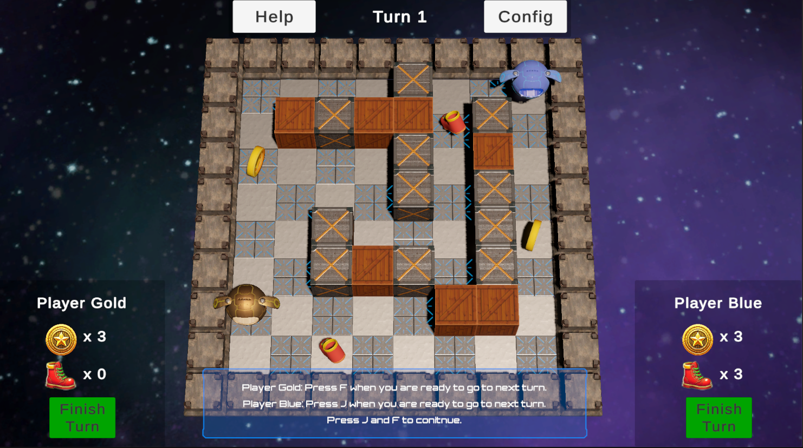

# Rebomb
A turn-based, Bomberman-style local multiplayer strategy game developed in Unity (C#). This game was created as part of a university project at TUM (Technical University of Munich).

## Play the Game
You can play the game directly in your browser on itch.io:
**[Play "Rebomb" Here](https://szmahdis.itch.io/rebomb)**

## Technical Achievements
This project features several complex systems to ensure replayability and smooth mechanics:

* **Procedural Map Generation:** While the first level serves as a static tutorial, all subsequent levels are generated using a custom implementation of the Random Walk Algorithm. This procedural content generation ensures every match features a unique and interesting layout.
* **Turn-Based Architecture:** Engineered a robust turn-management system in C# to handle player states, resource allocation, and the complex data-saving required to make the time travel mechanic function seamlessly.
* **Time Travel Feature:** Engineered a robust state management to accurately capture and rewind game rounds.
* **Advanced Explosion Management:** Built a system to asynchronously handle simultaneous blasts. The system features programmatic visual refinement, including distance-based visual decay for flames and distinct flame colors for special variants of bombs.
* **Cascaded Explosion Refinement:** Implemented chain-reaction logic from a Depth-First Search (DFS) to a Breadth-First Search (BFS) using a trigger queue. This ensures proper delay scaling and correct chronological triggering for specialized items.

  

